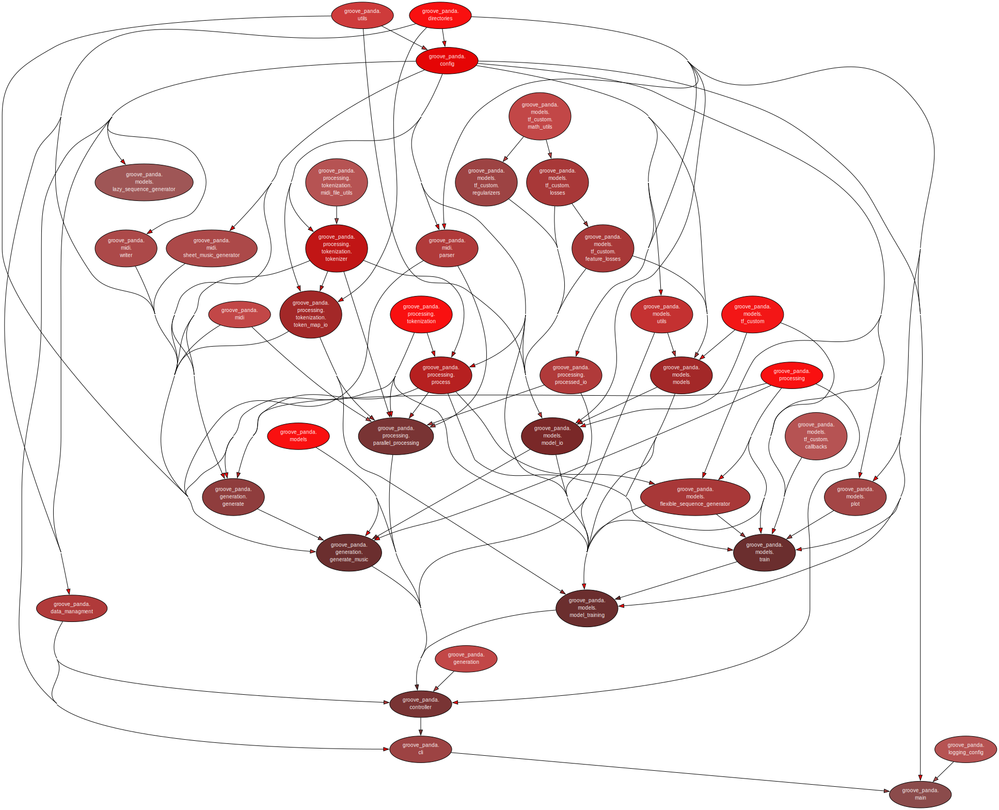
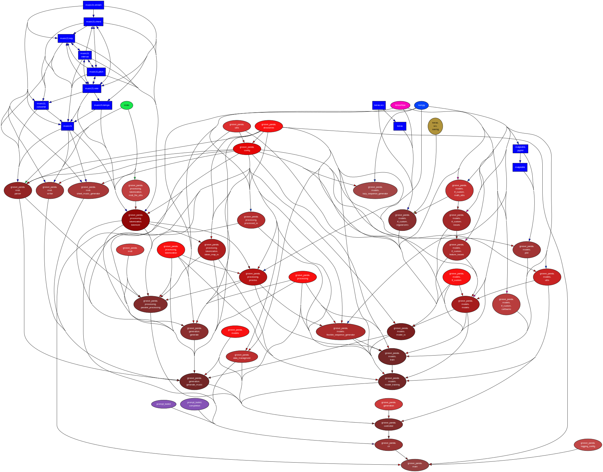

# Project Structure
## Repository root (dirs, files)
- `data` data that will be used/created by the program
- `src` source files of the program
- `docs` documentation of the program and workflows
- `scripts` project setup scripts
- `.gitignore` files that shouldn't be tracked by git for a clean repository
- `LICENSE` formal license specification for the repository
- `README.md` relevant information for all users
- `pyproject.toml` formal specification for all Python projects, stores dependencies
- `requirements.txt` contains all dependencies installed with pip

## Program Flow

## Data Package/Module Structure

## Source Package/Module Structure

 
## Current dependency structure of packages/modules
Internal: 
External: 
